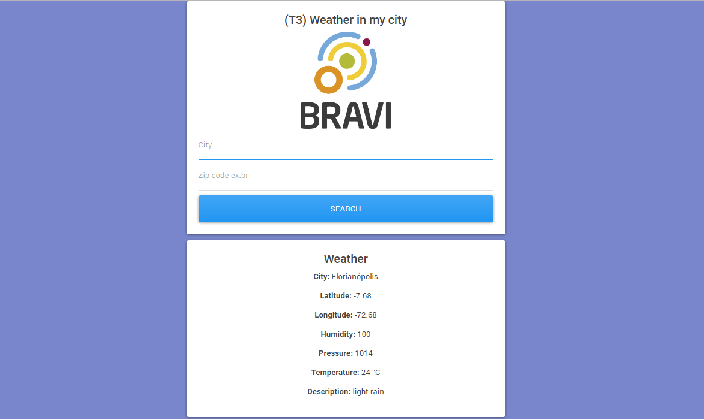
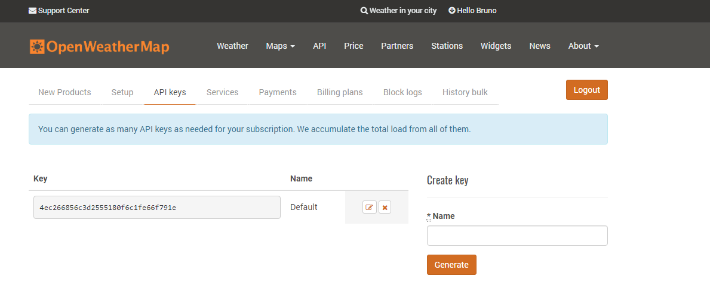

# 3. Weather in my city

This project was generated with [Angular CLI] version 7.3.3.

## API access key
This project uses an api (https://home.openweathermap.org) and requires a key to access the api services. To do this, create an account and generate a password.

To insert a key access to the weather.service.ts file on the path src / app / services as shown below

export class WeatherService {
  //INSERT THE ACCESS KEY HERE
  apiKey: string = '4ec266856c3d2555180f6c1fe66f791e';
  URI: string = '';

  constructor(private http: HttpClient) {
    this.URI = `https://api.openweathermap.org/data/2.5/weather?appid=${this.apiKey}&units=metric&q=`;
  }

  getWeather(cityName: string, countryCode: string) {
    return this.http.get(`${this.URI}${cityName},${countryCode}`);
  }
}

## Download dependencies

Run `npm install` at the project root to load the project-dependent libraries and files.

## Run app in server

Run `ng serve` for a dev server. Navigate to `http://localhost:4200/`. The app will automatically reload if you change any of the source files.

